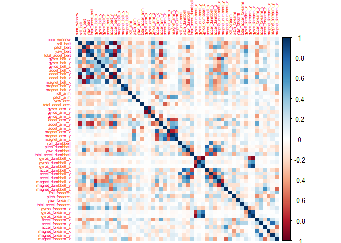
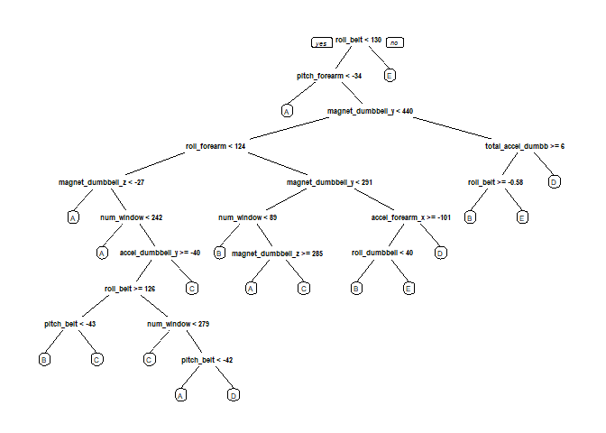

Practical Machine Learning Course Project Report  
================================================  

  
## Background  
Using devices such as Jawbone Up, Nike FuelBand, and Fitbit it is now possible to collect a large amount of data about personal activity relatively inexpensively. These type of devices are part of the quantified self movement - a group of enthusiasts who take measurements about themselves regularly to improve their health, to find patterns in their behavior, or because they are tech geeks. One thing that people regularly do is quantify how much of a particular activity they do, but they rarely quantify how well they do it. In this project, our goal will be to use data from accelerometers on the belt, forearm, arm, and dumbell of 6 participants. They were asked to perform barbell lifts correctly and incorrectly in 5 different ways. More information is available from the website here: [http://groupware.les.inf.puc-rio.br/har](http://groupware.les.inf.puc-rio.br/har) (see the section on the Weight Lifting Exercise Dataset).   

## Data Sources  
The training data for this project is available here:  
[https://d396qusza40orc.cloudfront.net/predmachlearn/pml-training.csv](https://d396qusza40orc.cloudfront.net/predmachlearn/pml-training.csv)  
The test data is available here:  
[https://d396qusza40orc.cloudfront.net/predmachlearn/pml-testing.csv](https://d396qusza40orc.cloudfront.net/predmachlearn/pml-testing.csv)  
The data for this project comes from this original source: [http://groupware.les.inf.puc-rio.br/har](http://groupware.les.inf.puc-rio.br/har). If you use the document you create for this class for any purpose please cite them as they have been very generous in allowing their data to be used for this kind of assignment.  

## Objective

The goal of this project is to predict the manner in which they did the exercise. This is the "classe" variable in the training set. We may use any of the other variables to predict with. We should create a report describing how We built your model, how We used cross validation, what We think the expected out of sample error is, and why We made the choices you did. We will also use your prediction model to predict 20 different test cases.  
  
## Reproducibility  
In order to reproduce the same results, you need a certain set of packages as well as setting a pseudo random seed equal to the one I have used.  


The following Libraries were used for this project, which you should install and load them in your working environment.  

## Package Required 

```r
library(rattle)
library(caret)
library(rpart)
library(rpart.plot)
library(corrplot)
library(randomForest)
library(RColorBrewer)
```
Finally, load the same seed with the following line of code:  

```r
set.seed(56789)
```

## Getting Data  
First of all, set your current working directory.  

```r
setwd("E:/JHU Data Science/assignment/Practical-Machine-Learning-Project")
```

The following code fragment downloads the dataset to the `data` folder in the current working directory.  

```r
trainUrl <-"https://d396qusza40orc.cloudfront.net/predmachlearn/pml-training.csv"
testUrl <- "https://d396qusza40orc.cloudfront.net/predmachlearn/pml-testing.csv"
trainFile <- "./data/pml-training.csv"
testFile  <- "./data/pml-testing.csv"
if (!file.exists("./data")) {
  dir.create("./data")
}
if (!file.exists(trainFile)) {
  download.file(trainUrl, destfile = trainFile, method = "curl")
}
if (!file.exists(testFile)) {
  download.file(testUrl, destfile = testFile, method = "curl")
}
rm(trainUrl)
rm(testUrl)
```

## Reading Data  
After downloading the data from the data source, we can read the two csv files into two data frames.  

```r
trainRaw <- read.csv(trainFile)
testRaw <- read.csv(testFile)
dim(trainRaw)
```

```
## [1] 19622   160
```

```r
dim(testRaw)
```

```
## [1]  20 160
```

```r
rm(trainFile)
rm(testFile)
```
The training data set contains 19622 observations and 160 variables, while the testing data set contains 20 observations and 160 variables. The `classe` variable in the training set is the outcome to predict.  

## Cleaning Data  
In this step, we will clean the dataset and get rid of observations with missing values as well as some meaningless variables.  

1. We clean the <b>Near Zero Variance</b> Variables.  

```r
NZV <- nearZeroVar(trainRaw, saveMetrics = TRUE)
head(NZV, 20)
```

```
##                        freqRatio percentUnique zeroVar   nzv
## X                       1.000000  100.00000000   FALSE FALSE
## user_name               1.100679    0.03057792   FALSE FALSE
## raw_timestamp_part_1    1.000000    4.26562022   FALSE FALSE
## raw_timestamp_part_2    1.000000   85.53154622   FALSE FALSE
## cvtd_timestamp          1.000668    0.10192641   FALSE FALSE
## new_window             47.330049    0.01019264   FALSE  TRUE
## num_window              1.000000    4.37264295   FALSE FALSE
## roll_belt               1.101904    6.77810621   FALSE FALSE
## pitch_belt              1.036082    9.37722964   FALSE FALSE
## yaw_belt                1.058480    9.97349913   FALSE FALSE
## total_accel_belt        1.063160    0.14779329   FALSE FALSE
## kurtosis_roll_belt   1921.600000    2.02323922   FALSE  TRUE
## kurtosis_picth_belt   600.500000    1.61553358   FALSE  TRUE
## kurtosis_yaw_belt      47.330049    0.01019264   FALSE  TRUE
## skewness_roll_belt   2135.111111    2.01304658   FALSE  TRUE
## skewness_roll_belt.1  600.500000    1.72255631   FALSE  TRUE
## skewness_yaw_belt      47.330049    0.01019264   FALSE  TRUE
## max_roll_belt           1.000000    0.99378249   FALSE FALSE
## max_picth_belt          1.538462    0.11211905   FALSE FALSE
## max_yaw_belt          640.533333    0.34654979   FALSE  TRUE
```

```r
training01 <- trainRaw[, !NZV$nzv]
testing01 <- testRaw[, !NZV$nzv]
dim(training01)
```

```
## [1] 19622   100
```

```r
dim(testing01)
```

```
## [1]  20 100
```

```r
rm(trainRaw)
rm(testRaw)
rm(NZV)
```

2. Removing some columns of the dataset that do not contribute much to the accelerometer measurements.  

```r
regex <- grepl("^X|timestamp|user_name", names(training01))
training <- training01[, !regex]
testing <- testing01[, !regex]
rm(regex)
rm(training01)
rm(testing01)
dim(training)
```

```
## [1] 19622    95
```

```r
dim(testing)
```

```
## [1] 20 95
```

3. Removing columns that contain `NA's`.  

```r
cond <- (colSums(is.na(training)) == 0)
training <- training[, cond]
testing <- testing[, cond]
rm(cond)
```

Now, the cleaned training data set contains 19622 observations and 54 variables, while the testing data set contains 20 observations and 54 variables.  

Correlation Matrix of Columns in the Training Data set.  

```r
corrplot(cor(training[, -length(names(training))]), method = "color", tl.cex = 0.5)
```

<!-- -->

## Partitioning Training Set  
we split the cleaned training set into a pure training data set (70%) and a validation data set (30%). We will use the validation data set to conduct cross validation in future steps.  

```r
set.seed(56789) # For reproducibile purpose
inTrain <- createDataPartition(training$classe, p = 0.70, list = FALSE)
validation <- training[-inTrain, ]
training <- training[inTrain, ]
rm(inTrain)
```
The Dataset now consists of 54 variables with the observations divided as following:  
1. Training Data: 13737 observations.  
2. Validation Data: 5885 observations.  
3. Testing Data: 20 observations.  

## Data Modelling  

### Decision Tree  
We fit a predictive model for activity recognition using <b>Decision Tree</b> algorithm.  

```r
modelTree <- rpart(classe ~ ., data = training, method = "class")
prp(modelTree)
```

<!-- -->

Now, we estimate the performance of the model on the <b>validation</b> data set.  

```r
predictTree <- predict(modelTree, validation, type = "class")
confusionMatrix(validation$classe, predictTree)
```

```
## Confusion Matrix and Statistics
## 
##           Reference
## Prediction    A    B    C    D    E
##          A 1492   37   10   84   51
##          B  270  551  120  134   64
##          C   55   32  818   49   72
##          D  116   17  117  655   59
##          E   84   89   61  140  708
## 
## Overall Statistics
##                                           
##                Accuracy : 0.7178          
##                  95% CI : (0.7061, 0.7292)
##     No Information Rate : 0.3427          
##     P-Value [Acc > NIR] : < 2.2e-16       
##                                           
##                   Kappa : 0.6409          
##                                           
##  Mcnemar's Test P-Value : < 2.2e-16       
## 
## Statistics by Class:
## 
##                      Class: A Class: B Class: C Class: D Class: E
## Sensitivity            0.7397  0.75895   0.7265   0.6168   0.7421
## Specificity            0.9529  0.88602   0.9563   0.9359   0.9242
## Pos Pred Value         0.8913  0.48376   0.7973   0.6795   0.6543
## Neg Pred Value         0.8753  0.96313   0.9366   0.9173   0.9488
## Prevalence             0.3427  0.12336   0.1913   0.1805   0.1621
## Detection Rate         0.2535  0.09363   0.1390   0.1113   0.1203
## Detection Prevalence   0.2845  0.19354   0.1743   0.1638   0.1839
## Balanced Accuracy      0.8463  0.82249   0.8414   0.7763   0.8331
```

```r
accuracy <- postResample(predictTree, validation$classe)
ose <- 1 - as.numeric(confusionMatrix(validation$classe, predictTree)$overall[1])
rm(predictTree)
rm(modelTree)
```

The Estimated Accuracy of the Random Forest Model is 71.7757009% and the Estimated Out-of-Sample Error is 28.2242991%.  

### Random Forest
We fit a predictive model for activity recognition using <b>Random Forest</b> algorithm because it automatically selects important variables and is robust to correlated covariates & outliers in general.  
We will use <b>5-fold cross validation</b> when applying the algorithm.  

```r
modelRF <- train(classe ~ ., data = training, method = "rf", trControl = trainControl(method = "cv", 5), ntree = 250)
modelRF
```

```
## Random Forest 
## 
## 13737 samples
##    53 predictor
##     5 classes: 'A', 'B', 'C', 'D', 'E' 
## 
## No pre-processing
## Resampling: Cross-Validated (5 fold) 
## Summary of sample sizes: 10988, 10990, 10991, 10990, 10989 
## Resampling results across tuning parameters:
## 
##   mtry  Accuracy   Kappa    
##    2    0.9933033  0.9915283
##   27    0.9971614  0.9964095
##   53    0.9938853  0.9922657
## 
## Accuracy was used to select the optimal model using the largest value.
## The final value used for the model was mtry = 27.
```

Now, we estimate the performance of the model on the <b>validation</b> data set.  

```r
predictRF <- predict(modelRF, validation)
confusionMatrix(validation$classe, predictRF)
```

```
## Confusion Matrix and Statistics
## 
##           Reference
## Prediction    A    B    C    D    E
##          A 1674    0    0    0    0
##          B    1 1137    1    0    0
##          C    0    1 1025    0    0
##          D    0    0    0  964    0
##          E    0    0    0    2 1080
## 
## Overall Statistics
##                                          
##                Accuracy : 0.9992         
##                  95% CI : (0.998, 0.9997)
##     No Information Rate : 0.2846         
##     P-Value [Acc > NIR] : < 2.2e-16      
##                                          
##                   Kappa : 0.9989         
##                                          
##  Mcnemar's Test P-Value : NA             
## 
## Statistics by Class:
## 
##                      Class: A Class: B Class: C Class: D Class: E
## Sensitivity            0.9994   0.9991   0.9990   0.9979   1.0000
## Specificity            1.0000   0.9996   0.9998   1.0000   0.9996
## Pos Pred Value         1.0000   0.9982   0.9990   1.0000   0.9982
## Neg Pred Value         0.9998   0.9998   0.9998   0.9996   1.0000
## Prevalence             0.2846   0.1934   0.1743   0.1641   0.1835
## Detection Rate         0.2845   0.1932   0.1742   0.1638   0.1835
## Detection Prevalence   0.2845   0.1935   0.1743   0.1638   0.1839
## Balanced Accuracy      0.9997   0.9993   0.9994   0.9990   0.9998
```

```r
accuracy <- postResample(predictRF, validation$classe)
ose <- 1 - as.numeric(confusionMatrix(validation$classe, predictRF)$overall[1])
rm(predictRF)
```

The Estimated Accuracy of the Random Forest Model is 99.9150382% and the Estimated Out-of-Sample Error is 0.0849618%.  
Random Forests yielded better Results, as expected!  

### Generalised Boosted Model 

```r
# model fit
set.seed(12345)
controlGBM <- trainControl(method = "repeatedcv", number = 5, repeats = 1)
modFitGBM  <- train(classe ~ ., data=training, method = "gbm",
                    trControl = controlGBM, verbose = FALSE)
modFitGBM$finalModel
```

```
## A gradient boosted model with multinomial loss function.
## 150 iterations were performed.
## There were 53 predictors of which 53 had non-zero influence.
```
Now, we estimate the performance of the model on the <b>validation</b> data set. 

```r
predictgbm <- predict(modFitGBM, validation)
confusionMatrix(validation$classe, predictgbm)
```

```
## Confusion Matrix and Statistics
## 
##           Reference
## Prediction    A    B    C    D    E
##          A 1673    1    0    0    0
##          B    9 1113   16    1    0
##          C    0    7 1016    3    0
##          D    0    8    8  946    2
##          E    0    5    1    8 1068
## 
## Overall Statistics
##                                           
##                Accuracy : 0.9883          
##                  95% CI : (0.9852, 0.9909)
##     No Information Rate : 0.2858          
##     P-Value [Acc > NIR] : < 2.2e-16       
##                                           
##                   Kappa : 0.9852          
##                                           
##  Mcnemar's Test P-Value : NA              
## 
## Statistics by Class:
## 
##                      Class: A Class: B Class: C Class: D Class: E
## Sensitivity            0.9946   0.9815   0.9760   0.9875   0.9981
## Specificity            0.9998   0.9945   0.9979   0.9963   0.9971
## Pos Pred Value         0.9994   0.9772   0.9903   0.9813   0.9871
## Neg Pred Value         0.9979   0.9956   0.9949   0.9976   0.9996
## Prevalence             0.2858   0.1927   0.1769   0.1628   0.1818
## Detection Rate         0.2843   0.1891   0.1726   0.1607   0.1815
## Detection Prevalence   0.2845   0.1935   0.1743   0.1638   0.1839
## Balanced Accuracy      0.9972   0.9880   0.9870   0.9919   0.9976
```

```r
accuracy <- postResample(predictgbm, validation$classe)
ose <- 1 - as.numeric(confusionMatrix(validation$classe, predictgbm)$overall[1])
rm(predictgbm)
```


## Predicting The Manner of Exercise for Test Data Set  
The accuracy of the 3 regression modeling methods above are:

Random Forest : 0.9992
Decision Tree : 0.7178
GBM : 0.9883

Now, we apply the <b>Random Forest</b> model to the original testing data set downloaded from the data source. We remove the problem_id column first.


```r
rm(accuracy)
rm(ose)
predict(modelRF, testing[, -length(names(testing))])
```

```
##  [1] B A B A A E D B A A B C B A E E A B B B
## Levels: A B C D E
```


